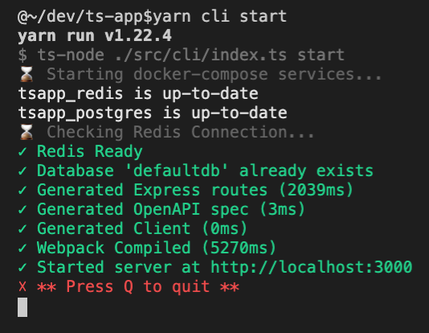

# ts-app: Full-stack TypeScript Development Framework

React, TypeScript, and Node.js are used in the project to develop an API-first application.

The project aims to support a "domain driven" approach. In order to provide a type-safe and productive developer experience for rapid web application development, a client library is automatically generated from the API. It provides a statically typed interface for interacting with the API from the React UI.

** **Check out the new Includes login flow, password reset, routing, emails and email previews, component library development via Cosmos, and more **

## Getting started

- `yarn` to install dependencies
- `yarn build` to build from source
- `yarn cli start` to start developer environment
- `yarn cli` to use developer CLI
    - Includes dev environment setup, docker management, database management, and more
    - [Full CLI docs](./src/cli)

## Developer experience



## Project structure

This project uses [TypeScript Project References](https://www.typescriptlang.org/docs/handbook/project-references.html) to organize modules. This gives us:
- Faster builds
- Formal project dependencies; subprojects can't import from other subprojects unless the dependency is configured

### Packages
- [cli](./src/cli) - Developer CLI tool
- [client](./src/client) - Front-end React App
- [common](./src/common) - Modules used by either browser or node environments
- [node](./src/node) - Modules used by node environments
- [server](./src/server) - Express server w/ tsoa API
- [openapi-client](./src/openapi-client) - Autogenerated TypeScript client; used to communicate with OpenAPI REST API from [client](./src/client)
- [cypress](./src/cypress) - Cypress tests

## System Requirements
- [Node.js 14+](https://nodejs.org/en/download/)
- [docker](https://www.docker.com) and [docker-compose](https://docs.docker.com/compose)
- [yarn](https://yarnpkg.com/en)

## Technologies Used
- [TypeScript](http://www.typescriptlang.org/)
- Backend
    - [Node.js](https://nodejs.org)
    - [Express](https://expressjs.com/)

        - Generates Express Routes from TypeScript controllers
        - Generates [OpenAPI ("Swagger")](https://swagger.io/docs/specification/about) specification, enabling automatic documentation and client library generation
    - [PostgreSQL](https://www.postgresql.org/) as RDBMS
        - [TypeORM](http://typeorm.io) for code-first database migrations
            - Optional: ORM-like queries
    - [Redis](https://redis.io/) for caching/messaging
- Frontend
    - [react](https://reactjs.org/)
    - [styled-components](https://styled-components.com/) for styling/css
    - [webpack](https://webpack.js.org) for bundling static assets
- Developer environment
    - [docker](https://www.docker.com/) and [docker-compose](https://docs.docker.com/compose) for non-Node.js project dependencies
    - Single `start` script that live reloads the API, UI, and related services
    - VSCode [launch.json](./.vscode/launch.json) settings have been included to support debugging
- Testing
    - [jest](https://jestjs.io) test runner/assertions/utilities
    - [cypress](https://www.cypress.io/) for end-to-end testing
    - [react-testing-library](https://testing-library.com/docs/react-testing-library/intro) for component testing

## Running Tests

### Jest Tests

Includes server node.js tests and front-end react-testing-library tests.

```
yarn cli test jest
```

### Cypress Tests

End to end tests that touch everything and hit a running version of the application

```
yarn cli test cypress
```

## Contributing
- Features and bug fixes welcome
